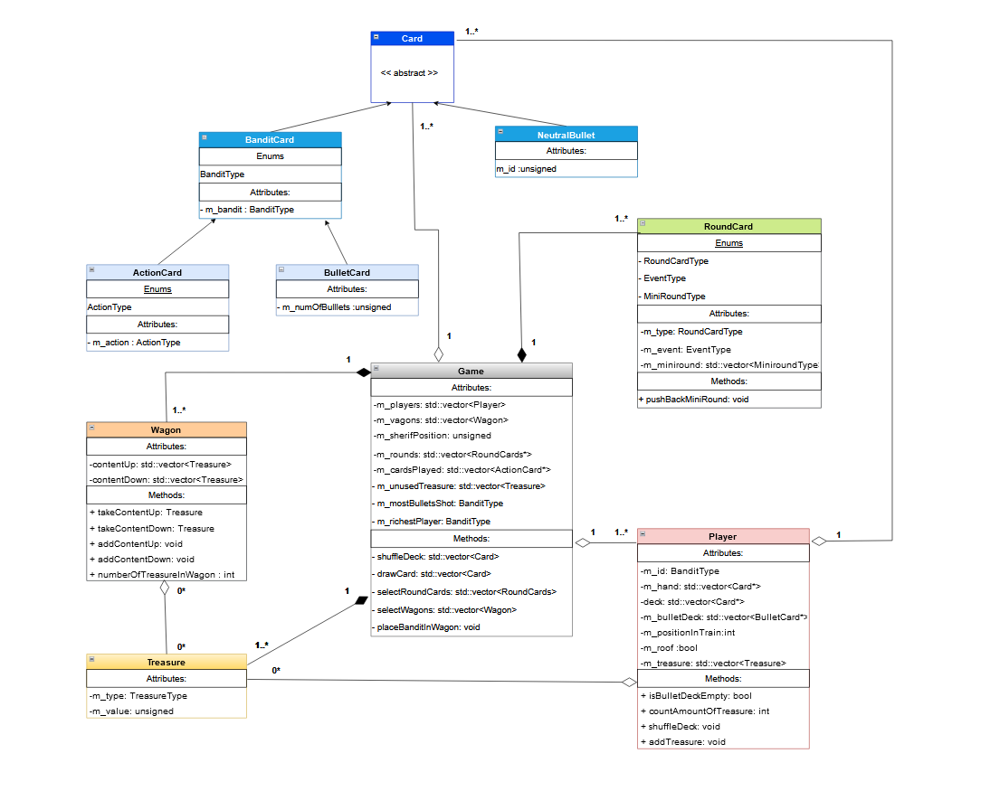
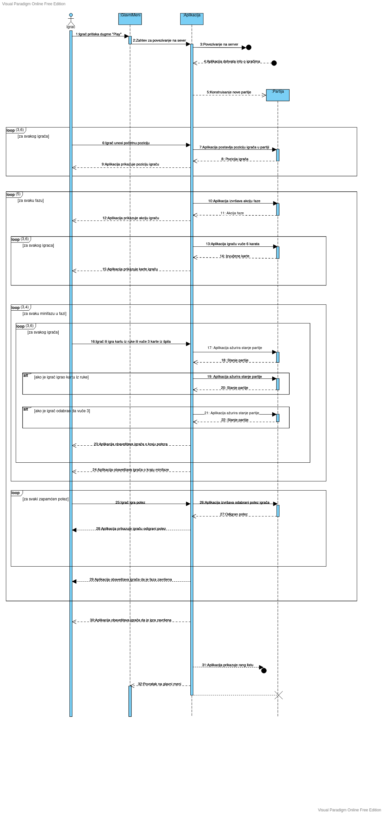
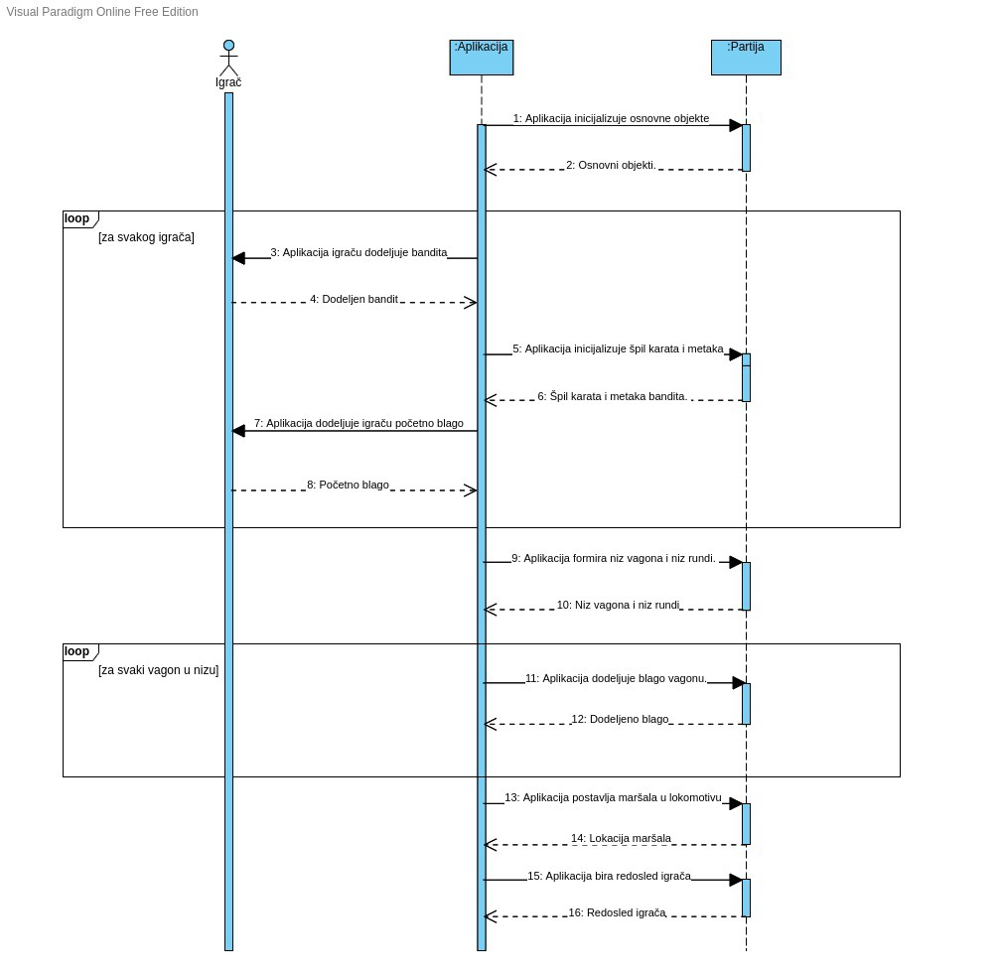
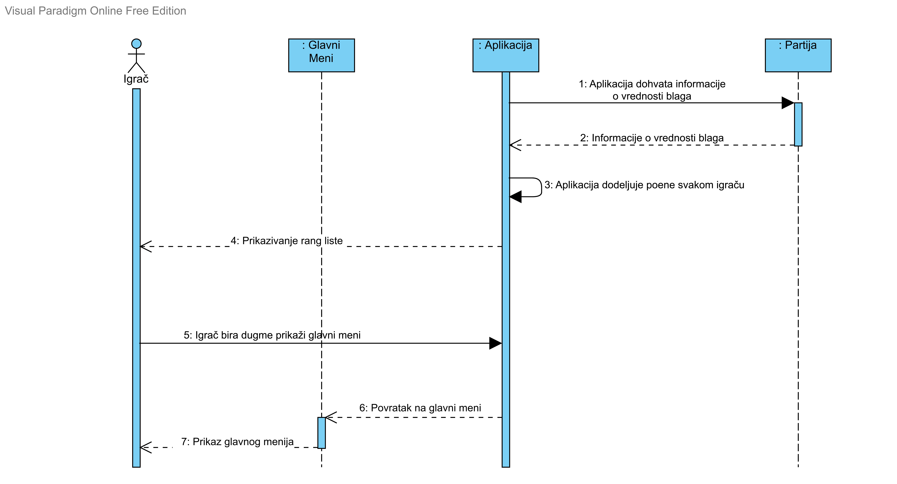
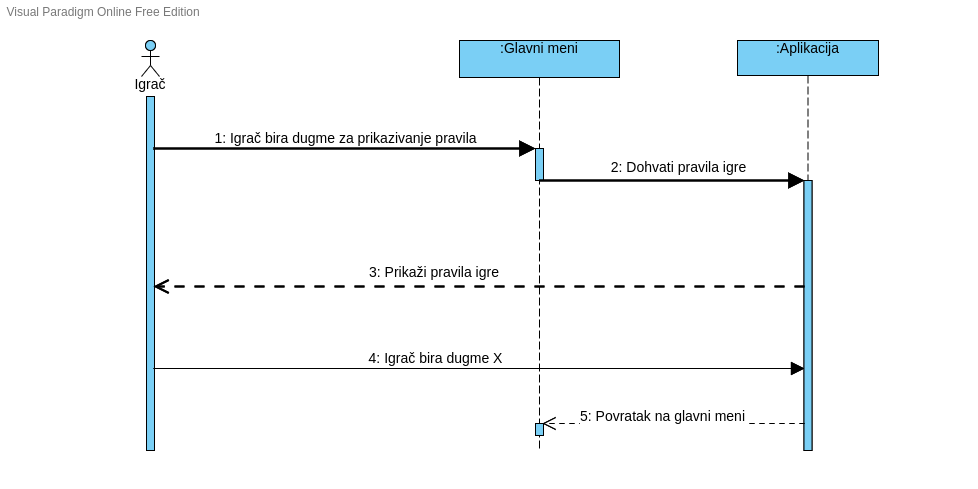
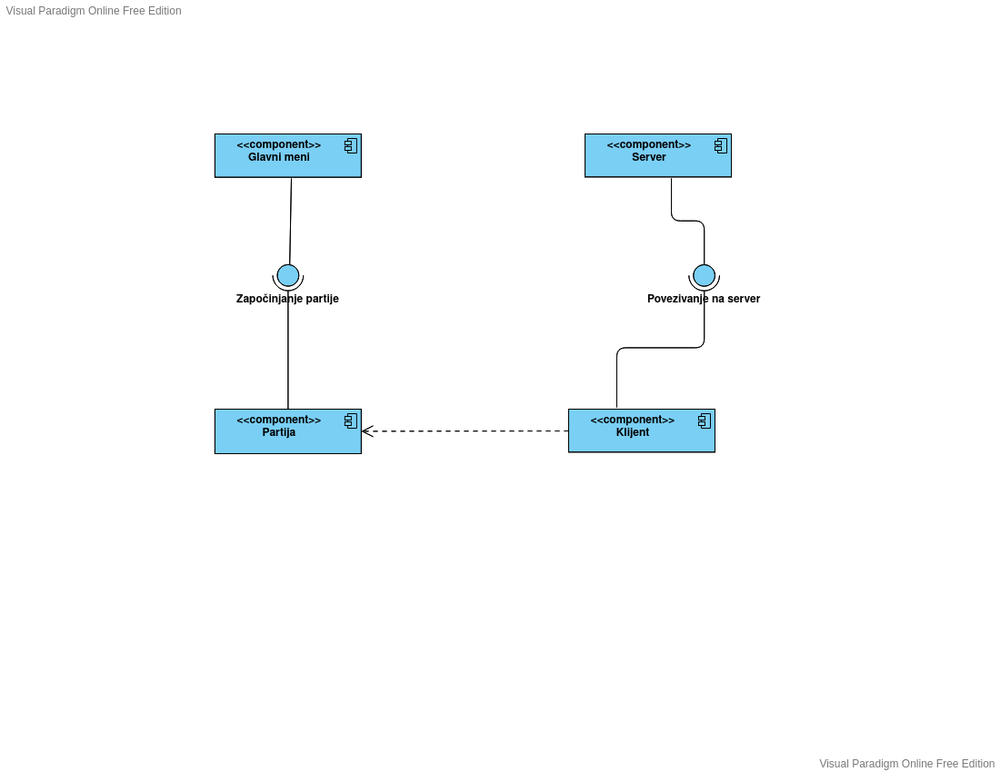

# Dokumentacija

## Opis igre:
Aplikacija Traffic Express je igra rađena po uzoru na društvenu igru Colt Express. Broj igrača je od 3 do 5. 

U beogradskoj gužvi, u 5 popodne, voz stoji zaglavljen sa 47 putnika u njemu. Nekoliko minuta kasnije, čuje se pucnjava i trčanje po krovu. Došli su teško naoružani banditi, da poštenim građanima otmu novac.
Svaki igrač je bandit i njegov cilj je da postane najbogatiji bandit u Beogradu!

Partija se sastoji od 5 rundi, a svaka runda ima dve faze:
- Faza 1: Svaki igrač postavlja 2-5 akcionih karata iz svoje ruke na zajedničku gomilu, pri čemu su karte okrenute nadole ili nagore, u zavisnosti od vrste runde. Umesto da igra kartu, igrač može i da vuče 3 karte iz svog špila.
- Faza 2: Akcione karte se prikazuju redosledom kojim su igrane i igrači biraju način na koji će ih odigrati.

Igra se odvija u vozu u kojem banditi mogu da se kreću iz jednog vagona u drugi, da trče po krovu, da udaraju druge bandite, pucaju u njih, pljačkaju druge putnike i pomeraju maršala. 
Voz ima onoliko vagona koliko je igrača, a svaki vagon ispunjen je draguljima, vrećama s novcem i koferima.

Svaki igrač počinje rundu sa 6 karata u ruci, pri čemu svaka karta označava jednu od ovih radnji. Na početku runde, otkriva karta koja prikazuje koliko će karata biti odigrano, da li će se igrati licem nagore ili nadole, pojedinačno ili u parovima, kao i koja će se akcija desiti na početku runde.
Igrač može da pokupi vreće, dragulje i kofere samo igranjem karte za krađu kada je u istom vagonu koji sadrži jedan od ovih predmeta - ali pošto svi planiraju da ukradu ovo blago, moraće da se kreće, udara i puca, ne bi li mu se ostali banditi sklonili s puta. Igrač može udariti nekoga samo u istom vagonu, a kada to uradi, bandit mora ispustiti blago.

Igrač može upucati nekog drugog igrača u susednom automobilu ili, ako je na krovu, bilo koga na vidiku. Kada to uradi, tom igraču daje jednu od svojih 6 karata metaka; ta karta se meša u protivničkom špilu, što mu verovatno daje mrtvu kartu u ruci, u budućem potezu i primorava da vuče karte umesto da igra. 
Ako se maršal nađe u istom vagonu kao i igrač, to je verovatno jer ga suparnici mame i rado će mu dati i metak. 

Na kraju igre, pobednik je igrač koji je sakupio najviše blaga!

## UML:

### Dijagram klasa:

### Dijagram slučajeva upotrebe:

### Igranje jedne partije igre:

**Kratak opis:** Igrač započinje jednu partiju igre iz glavnog menija aplikacije. Aplikacija učitava povezivanje na server. Nakon odigrane partije, aplikacija korisniku prikazuje informacije o osvojenim poenima i pobedniku. 

**Akteri:** Igrači - igraju jednu partiju igre

**Preduslovi:** Aplikacija je pokrenuta i prikazuje se glavni meni. 

**Postuslovi:** Igrač je vraćen u glavni meni.

**Osnovni tok:**
1. Igrač bira dugme “Play” iz glavnog menija. Prelazi se na slučaj upotrebe “Povezivanje na server”.
2. Aplikacija dohvata informacije o povezanim igračima.
3. Aplikacija konstruiše novu partiju i prelazi se na slučaj upotrebe “Inicijalizacija jedne partije”.
4. Sve dok ima igrača:
	* 4.1. Igrač bira početnu poziciju svog bandita.
5. Sve dok ima faza u partiji, za svaku fazu:
	* 5.1. Aplikacija izvršava akciju koja je dodeljena trenutnoj fazi.
	* 5.2. Za svakog igrača:
		* 5.2.1. Igrač vuče 6 karata iz svog špila.
	* 5.3. Sve dok ima minifaza u trenutnoj fazi, za svaku minifazu:
		* 5.3.1. Za svaki potez igrača u partiji:
			* 5.3.1.1. Ako je igrač izabrao jednu kartu iz ruke:
				* 5.3.1.1.1. Aplikacija pamti njegovu kartu i prikazuje je u skladu sa minifazom. Po završetku, prelazi se na korak 5.3.1.3.
			* 5.3.1.2. Ako je igrač odabrao da vuče 3 karte iz špila:
				* 5.3.1.2.1. Aplikacija nasumično dodeljuje igraču 3 karte iz špila. Prelazi se na korak 5.3.1.3.
			* 5.3.1.3. Aplikacija obaveštava da je potez gotov.
		* 5.3.2. Aplikacija obaveštava da je minifaza gotova. 
	* 5.4. Aplikacija prolazi kroz zapamćene karte igrača.
	* 5.5. Sve dok ima karata, za svaku zapamćenu kartu bandita:
		* 5.5.1. Igrač bira kako će da se odigra njegova karta.
		* 5.5.2. Aplikacija izvršava potez Igrača. 
		* 5.5.3. Aplikacija prikazuje šta je Igrač odigrao. 
	* 5.6. Aplikacija obaveštava da je faza gotova. 
6. Aplikacija obaveštava da je igra završena i prelazi se na slučaj upotrebe “Prikazivanje rang liste”. 
7. Aplikacija prelazi na glavni meni. 

**Alternativni tokovi:**
* A1: Neočekivani izlaz iz aplikacije: Ukoliko u bilo kom koraku korisnik prekine aplikaciju, sve zapamćene informacije o partiji se poništavaju i aplikacija završava rad. Slučaj upotrebe je završen. 
* A2: Prekid konekcije sa serverom: Ukoliko se u bilo kom trenutku igrač diskonektuje sa servera, aplikacija nastavlja partiju umesto njega igrajući nasumične poteze. Aplikacija prikazuje igraču prikazuje poruku da je diskonektovan i vraća ga u glavni meni. Slučaj upotrebe je završen. 

**Podtokovi:** /

**Specijalni zahtevi:** Svaki igrač mora biti povezan na internet i posedovati kod sebe klijent aplikacije. Server aplikacije mora biti pokrenut u trenutku pokretanja partije. 

**Dodatne informacije:** 

### Povezivanje na server:

**Kratak opis:** Igrač upisuje svoje ime i bira kada je spreman za početak partije.

**Akteri:** Igrači.

**Preduslovi:** Igrači su kliknuli dugme “Play” iz glavnog menija.

**Postuslovi:** Aplikacija je zapamtila informacije o igračima. 

**Osnovni tok:** 
1. Aplikacija prikazuje dijalog za podešavanje imena.
2. Igrač je pritisnuo dugme “Connect”.
	* 2.1. Ako je Igrač upisao svoje ime:
		* 2.1.1. Aplikacija čuva ime. Prelazi se na korak 3.
	* 2.2. Ako Igrač nije ništa upisao u polje za ime:
		* 2.2.1. Aplikacija mu dodeljuje nasumično ime. Prelazi se na korak 3.
3. Klijent šalje serveru TCP zahtev za povezivanje.
4. Server odobrava taj zahtev i proverava da li je klijent prvi koji se povezuje na server.
    * 4.1. Ako je Igrač prvi koji se konektovao na server:
		* 4.1.1. Igraču se dodeljuje uloga vlasnika sobe. Prelazi se na korak 5.
5. Uspostavlja se TCP konekcija i otvara se soba za čekanje.
6. Igrač pritiska dugme “Ready”. 
7. Ako je Igrač vlasnik sobe:
    * 7.1. Igrač pritiska dugme “Start” i pokreće se partija sa svim Igračima koji su označili da su spremni.

**Alternativni tokovi:**
* A1: Neočekivani izlaz iz aplikacije: Ukoliko u bilo kom koraku korisnik prekine aplikaciju, sve zapamćene informacije o partiji se poništavaju i aplikacija završava rad. Slučaj upotrebe je završen. 

**Podtokovi:** /

**Specijalni zahtevi:** /

**Dodatne informacije:** / 

### Inicijalizacija jedne partije:

**Kratak opis:** Aplikacija inicijalizuje sve objekte i kreira partiju na osnovu broja igrača.

**Akteri:** Igrači

**Preduslovi:** Igrači su kliknuli dugme “Ready”.

**Postuslovi:** Aplikacija započinje partiju. 

**Osnovni tok:** 
1. Aplikacija dohvata informacije o igračima. 
2. Aplikacija inicijalizuje osnovne objekte.
3. Za svakog igrača:
   * 3.1. Aplikacija nasumičnom odabirom dodeljuje nekog od preostalih bandita. 
   * 3.2. Aplikacija incijalizuje špil karata i špil metaka za svakog igrača.
   * 3.3. Aplikacija dodeljuje igraču početnu vrednost blaga.
4. Aplikacija formira niz vagona i niz rundi. 
5. Za svaki vagon u nizu:
   * 5.1. Aplikacija dodeljuje blago vagonu, na osnovu pravila igre.
6. Aplikacija postavlja maršala u lokomotivu. 
7. Aplikacija nasumično bira redosled kojim će igrači igrati.

**Alternativni tokovi:**
* A1: Neočekivani izlaz iz aplikacije: Ukoliko u bilo kom koraku korisnik prekine aplikaciju, sve zapamćene informacije o partiji se poništavaju i aplikacija završava rad. Slučaj upotrebe je završen. 

**Podtokovi:** /

**Specijalni zahtevi:** /

**Dodatne informacije:** /

### Prikazivanje rang liste:

**Kratak opis:** Aplikacija izračunava poene svakog igrača i proglašava pobednika.

**Akteri:** Igrači

**Preduslovi:** Završene su sve faze partije.

**Postuslovi:** Aplikacija prikazuje glavni meni.

**Osnovni tok:** 
1. Aplikacija dohvata informacije o vrednosti blaga koji je svaki igrač sakupio na kraju partije.
2. Aplikacija dodeljuje poene svakom igraču.
3. Aplikacija prikazuje sortiranu rang listu. 
4. Aplikacija proglašava pobednika.
5. Igrač bira dugme "Povratak na glavni meni".

**Alternativni tokovi:**
* A1: Neočekivani izlaz iz aplikacije: Ukoliko u bilo kom koraku korisnik prekine aplikaciju, sve zapamćene informacije o partiji se poništavaju i aplikacija završava rad. Slučaj upotrebe je završen. 

**Podtokovi:** /

**Specijalni zahtevi:** /

**Dodatne informacije:** /

### Prikazivanje pravila igre:

**Kratak opis:** Aplikacija prikazuje pravila igre Traffic Express.

**Akteri:** Igrači

**Preduslovi:** Aplikacija je pokrenuta i prikazuje se glavni meni. 

**Postuslovi:** Prikazuje se glavni meni.

**Osnovni tok:**
1. Igrač pritisne dugme “Game Rules”. 
2. Aplikacija prikazuje pravila igre korisniku.
3. Igrač pritiska dugme X.
4. Aplikacija prikazuje glavni meni.

**Alternativni tokovi:**
* A1: Neočekivani izlaz iz aplikacije: Ukoliko u bilo kom koraku korisnik prekine aplikaciju, sve zapamćene informacije o partiji se poništavaju i aplikacija završava rad. Slučaj upotrebe je završen. 

**Podtokovi:** /

**Specijalni zahtevi:** /

**Dodatne informacije:** / 

### Dijagram komponenti
